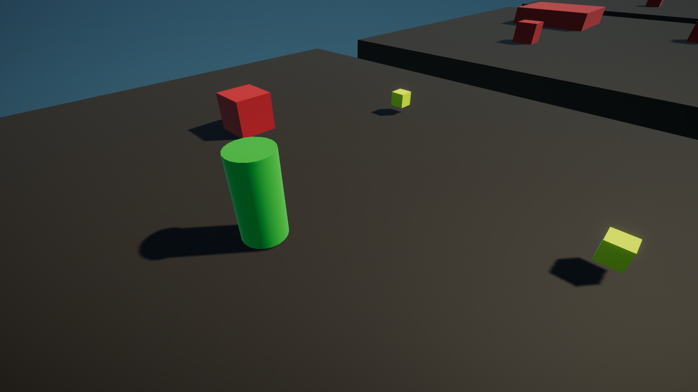
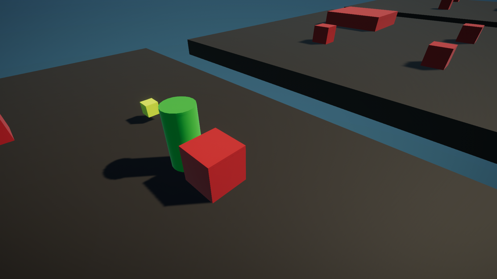
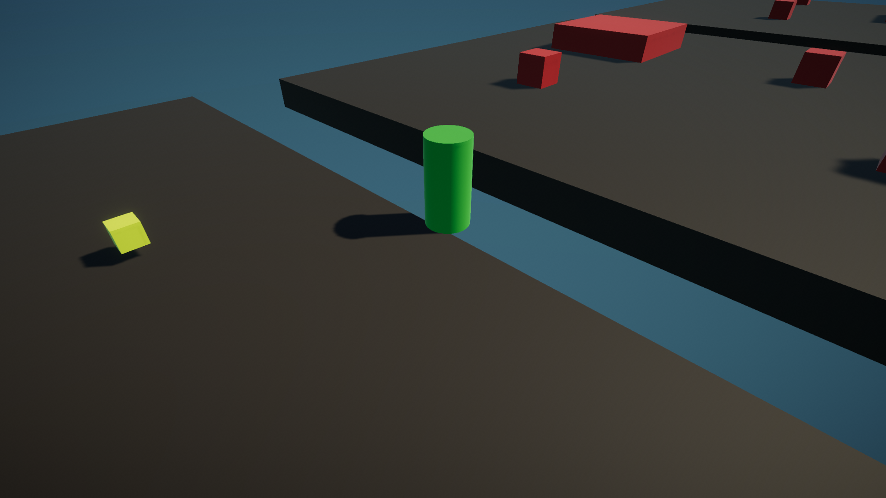
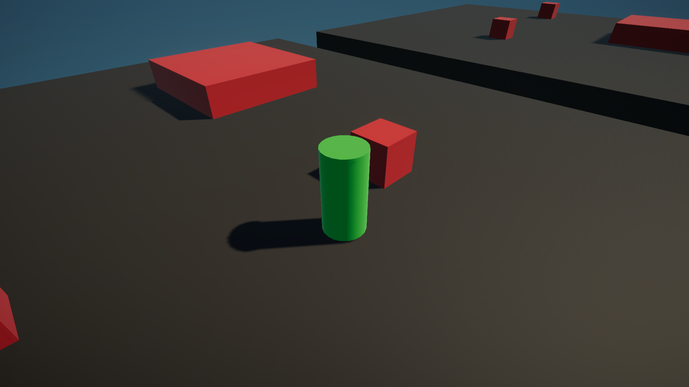

# 3D RPG Test

This is a Unity project for testing out mechanics for 3D RPG game.

## About

Currently implemented only player movement. It uses pathfinding based on where the mouse clicked, and transitions between platforms by jumping.
Player can interact with other objects currently only by physics (other objects can push it).

**Controlls**: left mouse click to move (thats it) 

## Running

Executable file is located in bin folder: ``` bin/RPG_Test.exe ```

## Screenshots






